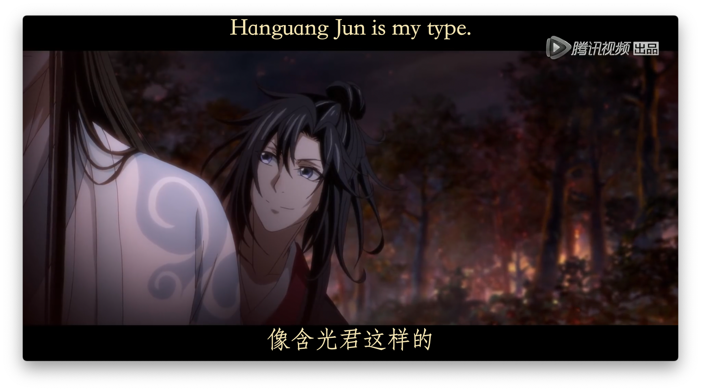

<h1>mpv2anki</h1>

 

A simple script to assist your language learning journey in any language by automatically capturing multimedia content from [mpv](https://mpv.io/) to [Anki](https://apps.ankiweb.net/). 
It extracts the current subtitles (target language and native/secondary language), corresponding audio, 
and screenshot when triggered, making it easy to create flashcards.

## Requirements
(all open-source)
- [mpv](https://mpv.io/) (or any software built on mpv like [IINA](https://iina.io/) (MacOS)) - _cross-platform media player_
- [ffmpeg](https://ffmpeg.org/) - _a suite of libraries to handle multimedia files_
- [Anki](https://apps.ankiweb.net/) - _powerful [SRS](https://en.wikipedia.org/wiki/Spaced_repetition) flashcard app_
- [AnkiConnect](https://ankiweb.net/shared/info/2055492159) - _Anki add-on_

_AnkiConnect addon must be installed in Anki and Anki must be running while using this script._

## Features

1. [x] Extract current subtitle text from MPV
2. [x] Capture audio segment corresponding to subtitle timing
3. [x] Take screenshots at current playback position
4. [x] Automatically create Anki cards with extracted content
5. [x] Integration with MPV's keybinding system

### Work in Progress 🚧

#### Custom Audio Segment Selection
Currently, the audio extraction strictly follows subtitle timing. I will work on an additional option that will allow to:
1. [ ] Set custom start and end points for audio clips independent of subtitle timing

#### Documentation
1. [ ] Documentation for non-technical and technical users
2. [ ] Documentation for IINA set-up

#### Video Stream
Audio extraction currently only works with local video files
1. [ ] Audio extraction for URL/Video stream support (platforms supported by [yt-dlp](https://github.com/yt-dlp/yt-dlp))

For video streams I recommend using free tools like [Abs Player](https://chromewebstore.google.com/detail/asbplayer-language-learni/hkledmpjpaehamkiehglnbelcpdflcab) 
that work directly in the web browser.

#### Field Mapping
1. [ ] Simplified field mapping configuration (no code editing required) for non-technical users
2. [ ] Video filename mapping for `[config.ANKI.FIELDS.SOURCE]`

## Documentation 🚧

More detailed documentation is **coming soon** and will be available in the `docs` folder.

_Questions or need help? Open a Discussion in this repository. 
Feel free to contribute._

### Notes for now:
- The current note type configurations can be found in `scripts/mpv2anki/modules/ankiconnect.lua`
  and `scripts/mpv2anki/config.lua`

- mpv keybindings can be found inside `input.conf`, `scripts/mpv2anki/config.lua`
  and `scripts/mpv2anki/main.lua`
- When setting up your MPV keybindings in `input.conf`, feel free to customize
  them to your preferences. However, make sure to review both `main.lua` and `config.lua`
  to ensure your changes don't conflict with the script's functionality.

### Default mpv Keybindings

| Key       | Command | Description | 
|-----------|---------|-------------|
| `Shift+d` | `script-binding pause-and-capture` | Pause and capture to Anki |
| `Shift+h` | `script-binding show-commands` | Show all commands |

> **Note**: You can customize these keybindings in your MPV configuration, 
> but make sure to check `main.lua` and `config.lua` to avoid conflicts with 
> the script's functionality. This also applies to MPV-based media players like IINA (check the software settings).

### OS Support

This script has been primarily tested on macOS. While it should work on Linux and Windows, I currently don't have access to these OS for thorough testing.
Feel free to contribute.

### Makefile Commands

| Command | Description                                                    | Notes |
|---------|----------------------------------------------------------------|-------|
| `make sync-to-mpv` | Copy files to MPV configuration directory according to your OS | **WARNING**: Will replace your existing configuration files in the MPV directory |
| `make help` | Display all available commands                                 | Shows descriptions for each command |

---

## GIF
GIF from 魔道祖师 (_Mo Dao Zu Shi_  |  _Grandmaster of Demonic Cultivation_  |  _The Founder of Diabolism_  |  _The Master of Diabolism_) S01:E02
- [My Anime List (MAL)](https://myanimelist.net/anime/37208/Mo_Dao_Zu_Shi)
- [Douban 豆瓣](https://movie.douban.com/subject/27015848/)

Seen in GIF:
- _Anki add-on with pinyin : [Hanzi2Ruby](https://github.com/alyssabedard/Hanzi2Ruby)_ (coming soon)

- _Anki Retro Note Type: [RetroKeAi](https://github.com/alyssabedard/RetroKeAi)_ (coming soon)

