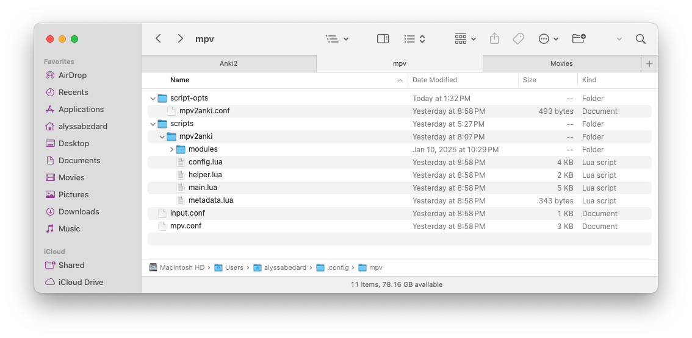
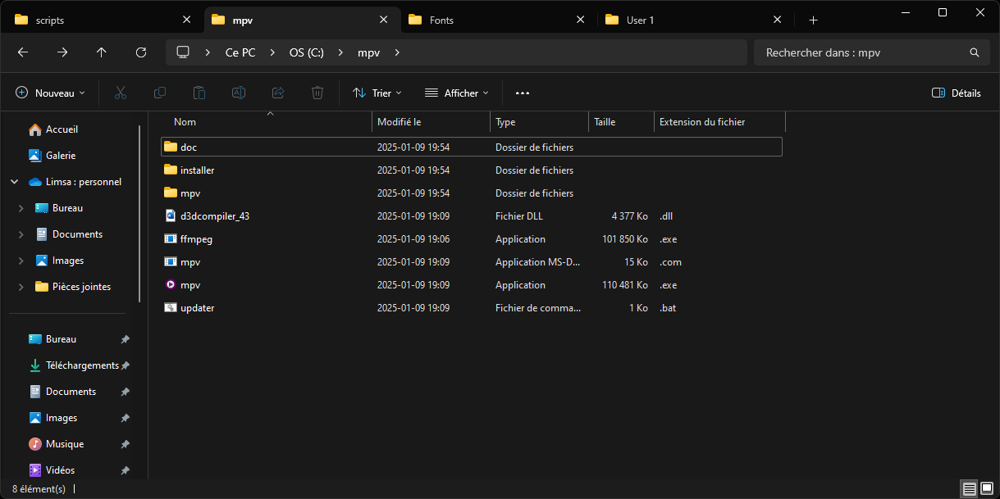
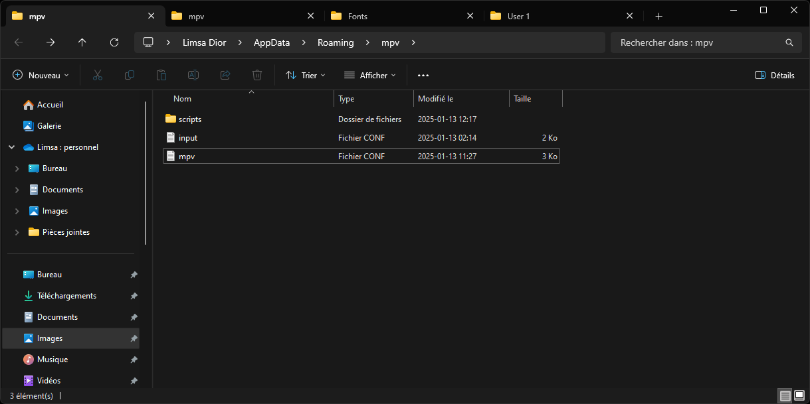

# mpv2anki- Quick Start Guide

## Setup Overview
1. Install required software (MPV, Anki, AnkiConnect, FFmpeg)
2. Import the mpv2anki note type in Anki:
3. Copy the script files to your MPV configuration directory
4. Configure paths and anki configurations in mpv2anki.conf
5. Start Anki
6. Open a video with MPV
7. Use Shift+d to create cards (when paused at subtitles)

> ⚠️ **Note:** Restart MPV after making any changes to configuration files or scripts for the changes to take effect.

## Requirements
(all open-source)
- [mpv](https://mpv.io/) (or any software built on mpv like [IINA](https://iina.io/) (MacOS)) - _cross-platform media player_
- [ffmpeg](https://ffmpeg.org/) - _a suite of libraries to handle multimedia files_
- [Anki](https://apps.ankiweb.net/) - _powerful [SRS](https://en.wikipedia.org/wiki/Spaced_repetition) flashcard app_
- [AnkiConnect](https://ankiweb.net/shared/info/2055492159) - _Anki add-on_

> **Note**: _AnkiConnect add-on must be installed in Anki and 
> Anki must be running while using this script._


## Installation

### 1. Directory Setup

Copy the files to your MPV configuration directory based on your operating system:

| Operating System | Configuration Path |
|-----------------|-------------------|
| Windows | `%APPDATA%/mpv/` |
| macOS | `~/.config/mpv/` |
| Linux | `~/.config/mpv/` |

The files should follow this structure and naming:
```
├── mpv
│   ├── input.conf
│   ├── mpv.conf
│   ├── script-opts
│   │   └── mpv2anki.conf
│   └── scripts
│       └── mpv2anki
│           ├── config.lua
│           ├── helper.lua
│           ├── main.lua
│           ├── metadata.lua
│           └── modules
│               ├── ankiconnect.lua
│               ├── audio.lua
│               ├── playback.lua
│               ├── screenshot.lua
│               ├── subtitles.lua
│               └── views.lua
```

### 2. Configuration

1. Open `script-opts/mpv2anki.conf` and configure:
  - Set your operating system (`system_type`):
    - `windows`
    - `macos`
    - `linux`

  - Set FFmpeg path (`ffmpeg_path`):
    - Windows: typically `C:/ffmpeg/bin/ffmpeg.exe`
    - macOS: typically `/usr/local/bin/ffmpeg`
    - Linux: typically `/usr/bin/ffmpeg`

  - Configure Anki settings:
    - `anki_username`: Your [Anki profile](https://docs.ankiweb.net/profiles.html) name
    - `deck_name`: Your target [deck](https://docs.ankiweb.net/getting-started.html#decks)
    - `note_type`: Card [type](https://docs.ankiweb.net/getting-started.html#note-types) (default: mpv2anki)
    - [Field](https://docs.ankiweb.net/getting-started.html#notes--fields) mappings for your cards
      - For additional fields beyond the default ones, modify:
        - `mpv/scripts/mpv2anki/modules/ankiconnect.lua`
        - `mpv/scripts/mpv2anki/config.lua`
        - `mpv/scripts/mpv2anki/script-opts/mpv2anki.conf`
        
2. Make sure AnkiConnect is:
  - Installed in Anki
  - Anki is running when you use the script
  - Default port (8765) is not blocked

### 3. Anki Note Type
Import the mpv2anki note type in Anki just to get the script working.
You can change the script and Note Type later according to your preferences.
1. Download the [Sentence Mining.apkg](note_types/basic) note type
2. Open Anki
3. File → Import → select the downloaded `Sentence Mining.apkg`


## Usage
1. Start Anki
2. Open a video with MPV
3. Use the keyboard shortcuts to create cards

Note: By default, cards can only be created when the video 
is paused at a frame with subtitles. Creating cards 
without subtitle dependency (using timestamp instead) is 
coming in a future update.

### Default Shortcuts

| Shortcut | Action | Customization |
|----------|---------|---------------|
| Shift+d | Pause video and capture card | Change in mpv2anki.conf: `shortcut_pause_and_capture` |
| Shift+h | Show available commands | Change in mpv2anki.conf: `shortcut_show_commands` |

You can customize these shortcuts by editing the values in `script-opts/mpv2anki.conf` or `input.conf`.

## Card Fields

The script creates cards with:
- Sentence (subtitle at capture time)
- Translation (second subtitle track if available)
- Screenshot
- Audio snippet

Configure the field names in `script-opts/mpv2anki.conf` to match your note type:
```
field_subtitle1=Sentence
field_subtitle2=Translation
field_audio=SentenceAudio
field_screenshot=Screenshot
```
⚠️ To add custom fields beyond the default ones, you can modify:
- `mpv/scripts/mpv2anki/modules/ankiconnect.lua` for AnkiConnect field handling
- `mpv/scripts/mpv2anki/config.lua` for field configurations


## Media Settings

Default formats:
- Screenshots: JPG
- Audio: MP3

Change formats in `mpv2anki.conf`:
```
format_image=jpg
format_audio=mp3
```

## Troubleshooting

1. **FFmpeg Path Issues**
  - Verify FFmpeg is installed
  - Check the path in configuration matches your installation
  - Try using full path to FFmpeg executable
2. **AnkiConnect Issues**
  - Ensure Anki is running
  - Check if port 8765 is available
  - Verify AnkiConnect add-on is installed
3. **mpv Configuration**
  - Verify files are in correct directories 
  - Check file permissions
  - Ensure configuration paths match your system 

## Need Help?

If you need assistance:
1. Check the [GitHub Discussions](https://github.com/alyssabedard/mpv2anki/discussions) section
2. Open a new discussion for setup help
3. Check existing discussions for similar issues

For bug report or feature request
1. Please open an [issue](https://github.com/alyssabedard/mpv2anki/issues) on GitHub 

## Contributing

[Contributions](../.github/CONTRIBUTING.md) are welcome! Feel free to:
- Report bugs
- Suggest features
- Submit pull requests 
- Share your use cases

## Screenshots for troubleshooting

Please check this [folder](screenshots/troubleshooting) for more screenshots.








