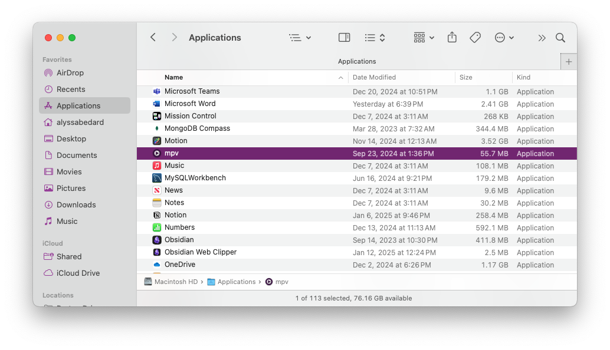
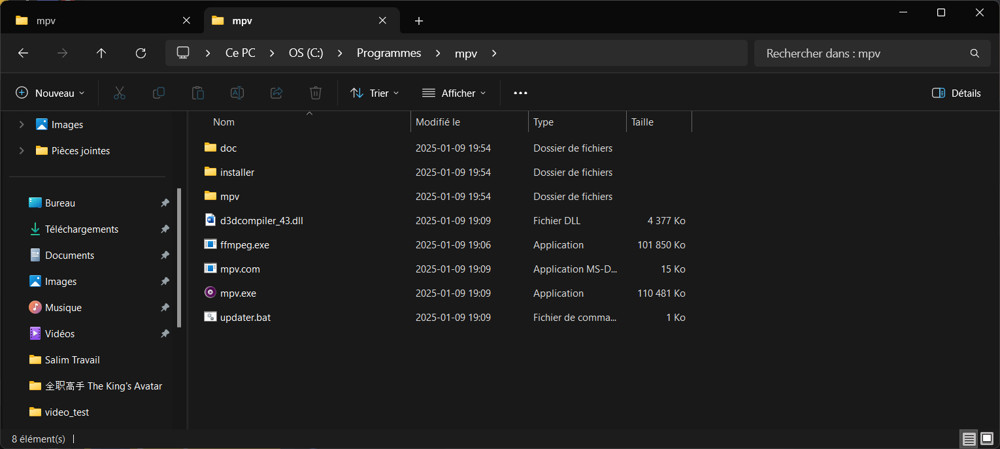

# mpv2anki- Quick Start Guide

## Setup Overview
1. Install required software (MPV, Anki, AnkiConnect, FFmpeg)
2. Import the mpv2anki note type in Anki:
3. Copy the script files to your MPV configuration directory
4. Configure paths and anki configurations in mpv2anki.conf
5. Start Anki
6. Open a video with MPV
7. Use Shift+d to create cards (when paused at subtitles)


> ⚠️ **Note:** Restart MPV after making any changes to configuration files or scripts for the changes to take effect.

## Requirements
_Read [Installation](#installation) for **mpv** and **ffmpeg**_
- [mpv](https://mpv.io/) (or any software built on mpv like [IINA](https://iina.io/) (MacOS)) - _cross-platform media player_
- [ffmpeg](https://ffmpeg.org/) - _a suite of libraries to handle multimedia files_
- [Anki](https://apps.ankiweb.net/) - _powerful [SRS](https://en.wikipedia.org/wiki/Spaced_repetition) flashcard app_
- [AnkiConnect](https://ankiweb.net/shared/info/2055492159) - _Anki add-on_

> **Note**: _AnkiConnect add-on must be installed in Anki and 
> Anki must be running while using this script._


## Installation

When installing mpv, you'll need to complete two separate manual steps. 

First, you need to install the MPV video player on your system - unlike 
standard software installations, MPV requires you to manually place its 
files/app in the correct system location and sometimes set proper permissions. 
Second, you need to place **mpv2anki** custom MPV **configuration file** (`mpv.conf`, `input.conf`, `scripts/` and `script-opts/`) in a different 
location that tells MPV how to work with our specific scripts. This config file 
is separate from the MPV installation and goes in your system's configuration 
directory. Both steps are manual because MPV is designed to be flexible and 
doesn't come with an automatic installer.


## 1. Install MPV Player and ffmpeg

### Windows
1. Download MPV player from [mpv.io](https://mpv.io)
2. Under "Windows builds by shinchiro (git)" (or any other build), download:
`mpv-x86_64-[date]-git-[hash].7z` and `ffmpeg-x86_64-git-[hash].7z`
Note: Choose the regular version, not the ones marked 'dev' or 'v3'
3. Place the MPV files and `ffmpeg.exe` in `C:\Program Files\mpv` (go to `C:\Program Files` and create a `mpv` folder)
4. Add MPV to your system PATH:
    - Open "Environment Variables" (search in Windows start menu)
    - Under "System Variables", find and click "Path"
    - Click "New" and add `C:\Program Files\mpv`
    - Click OK to save

### macOS
1. Install MPV  
Using Homebrew
    ```bash
    brew install mpv
    ```
    Or download MPV player from [mpv.io](https://mpv.io). 
    Store inside the `Applications` folder
    ```
    /Applications/mpv.app
    ```
2. Install ffmpeg
    ```
    brew install ffmpeg
    ```


### Linux
1. Install MPV using your package manager (need confirmation, I haven't personally test it):
    ```bash
    # Ubuntu/Debian
    sudo apt install mpv
    
    # Fedora
    sudo dnf install mpv
    
    # Arch
    sudo pacman -S mpv
    ```
2. Install ffmpeg

    Use your distribution's package manager:
    
    For Ubuntu/Debian:
    ```bash
    sudo apt update
    sudo apt install ffmpeg
    ```
    
    For Fedora:
    ```bash
    sudo dnf install ffmpeg
    ```
    
    For Arch Linux:
    ```bash
    sudo pacman -S ffmpeg
    ```

### Verification
After installation on any system, verify it's working by running:
```bash
ffmpeg -version
```


## 2. Configure MPV

The `mpv.conf` file in this repository contains custom settings for **mpv2anki**. 
You'll need to place it in:

### Windows
`Windows` + `r`
```
%APPDATA%
```
Create a mpv folder following this path:
```
%APPDATA%\mpv\
```
_Note_: Windows uses `AppData` for config which typically
expands to `C:\Users\YourUsername\AppData\Roaming\mpv\`


### macOS
When in Finder:
- `Finder` > `Go` > `Go to Folder...`
- Shortcut : `cmd` + `shift` + `g` 
```
~/.config/
```
Create a mpv folder following this path:
```
~/.config/mpv/
```

### Linux
```
~/.config/
```
Create a mpv folder following this path:
```
~/.config/mpv/
```

### Summary

| OS | MPV Application Location                   | Config File Location |
|----------|--------------------------------------------|-------------------|
| Windows | `C:\Program Files\mpv`                     | `%APPDATA%\mpv\mpv.conf` |
| macOS (Homebrew) | `/usr/local/bin/mpv`                       | `~/.config/mpv/mpv.conf` |
| macOS (Manual) | Finder: `/Applications/mpv.app` terminal: `/Applications/mpv.app/Contents/MacOS/mpv` | `~/.config/mpv/mpv.conf` |
| Linux | `/usr/bin/mpv`                             | `~/.config/mpv/mpv.conf` |

Notes:
- macOS has two common locations depending on installation method:
  - Homebrew installs to `/usr/local/bin/mpv`
  - Manual installation goes to `/Applications/mpv.app` (drag and drop file to `Applications` folder)
- The config file location stays the same regardless of how MPV is installed on macOS
- Windows config typically expands to `C:\Users\YourUsername\AppData\Roaming\mpv\`
- Windows mpv path needs to be declared in system PATH
  


### Files structure inside `mpv/`
The files should follow this structure and naming:
```
├── mpv
│   ├── input.conf
│   ├── mpv.conf
│   ├── script-opts
│   │   └── mpv2anki.conf
│   └── scripts
│       └── mpv2anki
│           ├── config.lua
│           ├── helper.lua
│           ├── main.lua
│           ├── metadata.lua
│           └── modules
│               ├── ankiconnect.lua
│               ├── audio.lua
│               ├── playback.lua
│               ├── screenshot.lua
│               ├── subtitles.lua
│               └── views.lua
```

## 3. mpv2anki Configurations
Now that mpv and ffmpeg are properly installed. Let's change 
**mpv2anki** config files. (OS, Anki Fields and mpv key binding set up)

1. Open `script-opts/mpv2anki.conf` and configure the following:
   - Set your operating system (`system_type`):
     - `windows`
     - `macos`
     - `linux`

   - Set FFmpeg path (`ffmpeg_path`):
     - Windows: typically `C:\Program Files\mpv\ffmpeg.exe` (`C:\\Program Files\\mpv\\ffmpeg.exe`)
     - macOS: typically `/usr/local/bin/ffmpeg`
     - Linux: typically `/usr/bin/ffmpeg`

   - Configure Anki settings:
     - `anki_username`: Your [Anki profile](https://docs.ankiweb.net/profiles.html) name
     - `deck_name`: Your target [deck](https://docs.ankiweb.net/getting-started.html#decks)
     - `note_type`: Card [type](https://docs.ankiweb.net/getting-started.html#note-types) (default: mpv2anki)
     - [Field](https://docs.ankiweb.net/getting-started.html#notes--fields) mappings for your cards
       - For additional fields beyond the default ones, modify:
         - `mpv/scripts/mpv2anki/modules/ankiconnect.lua`
         - `mpv/scripts/mpv2anki/config.lua`
         - `mpv/scripts/mpv2anki/script-opts/mpv2anki.conf`
        
2. Make sure AnkiConnect is:
  - Installed in Anki
  - Anki is running when you use the script
  - Default port (8765) is not blocked

## 4. Add the mpv2anki Note Type
Import the mpv2anki note type in Anki just to get the script working.
You can change the script and Note Type later according to your preferences.
1. Download the [Sentence Mining.apkg](note_types/basic) note type
2. Open Anki
3. File → Import → select the downloaded `Sentence Mining.apkg` (or double-click the actual file `Sentence Mining.apkg`)


## 5. Usage
1. Start Anki
2. Open a video with MPV
3. Use the keyboard shortcuts to create cards

Note: By default, cards can only be created when the video 
is paused at a frame with subtitles. Creating cards 
without subtitle dependency (using timestamp instead) is 
coming in a future update.

### Default Shortcuts

| Shortcut | Action | Customization |
|----------|---------|---------------|
| Shift+d | Pause video and capture card | Change in mpv2anki.conf: `shortcut_pause_and_capture` |
| Shift+h | Show available commands | Change in mpv2anki.conf: `shortcut_show_commands` |

You can customize these shortcuts by editing the values in `script-opts/mpv2anki.conf` or `input.conf`.

### Card Fields

The script creates cards with:
- Sentence (subtitle at capture time)
- Translation (second subtitle track if available)
- Screenshot
- Audio snippet

Configure the field names in `script-opts/mpv2anki.conf` to match your note type:
```
field_subtitle1=Sentence
field_subtitle2=Translation
field_audio=SentenceAudio
field_screenshot=Screenshot
```
⚠️ To add custom fields beyond the default ones, you can modify:
- `mpv/scripts/mpv2anki/modules/ankiconnect.lua` for AnkiConnect field handling
- `mpv/scripts/mpv2anki/config.lua` for field configurations


### Media Settings

Default formats:
- Screenshots: JPG
- Audio: MP3

Change formats in `mpv2anki.conf`:
```
format_image=jpg
format_audio=mp3
```


# Troubleshooting

1. **FFmpeg Path Issues**
   - Verify FFmpeg is installed
   - Check the path in configuration matches your installation
   - Try using full path to FFmpeg executable
2. **AnkiConnect Issues**
   - Ensure Anki is running
   - Check if port 8765 is available
   - Verify AnkiConnect add-on is installed
3. **mpv Configuration**
   - Verify files and mpv are in correct directories 
   - Check file permissions
   - Ensure configuration paths match your system 

## Need Help?

If you need assistance:
1. Check the [GitHub Discussions](https://github.com/alyssabedard/mpv2anki/discussions) section
2. Open a new discussion for setup help
3. Check existing discussions for similar issues

For bug report or feature request
1. Please open an [issue](https://github.com/alyssabedard/mpv2anki/issues) on GitHub 

## Contributing

[Contributions](../.github/CONTRIBUTING.md) are welcome! Feel free to:
- Report bugs
- Suggest features
- Submit pull requests 
- Share your use cases

## Screenshots for troubleshooting

Please check this [folder](screenshots/troubleshooting) for more screenshots.

#### macOS

#### macOS - mpv media player


#### macOS - mpv config files


#### Windows - mpv media player + ffmpeg.exe
(French Canadian Settings, `Programmes` = `Program Files`)_


#### Windows - mpv config files


